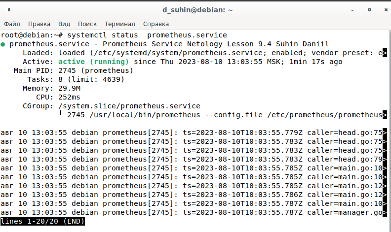
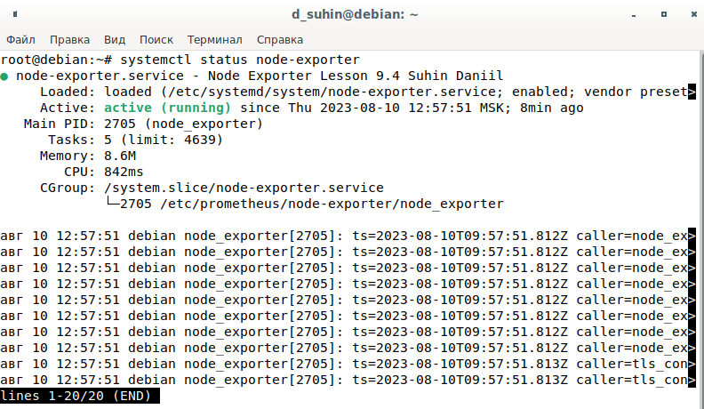
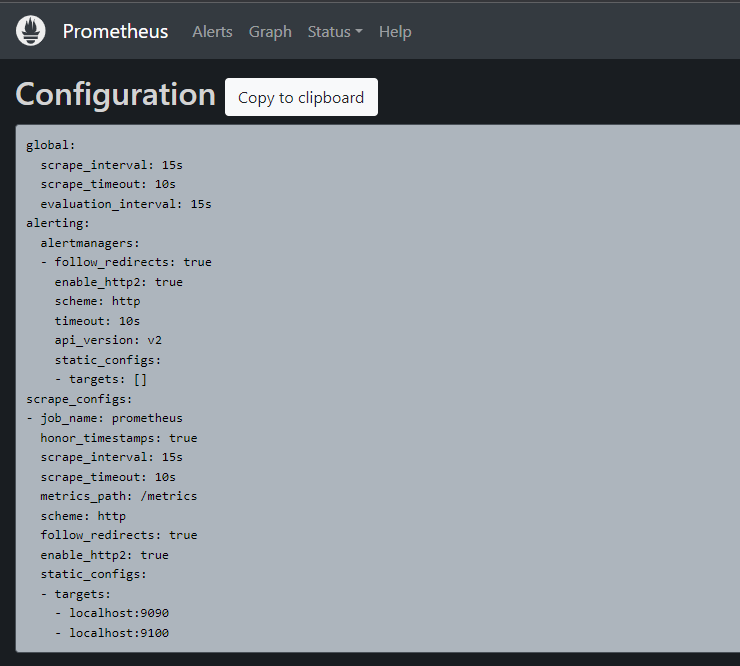
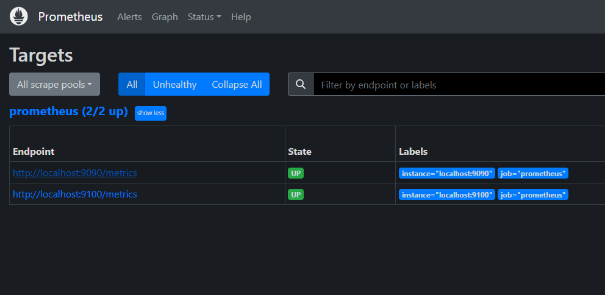

# Домашнее задание к занятию 9.4 «Prometheus»

### Задание 1

Установите Prometheus.

*Приведите скриншот systemctl status prometheus, где будет написано: prometheus.service — Prometheus Service Netology Lesson 9.4 — [Ваши ФИО].*

---

### Задание 2

Установите Node Exporter.

*Приведите скриншот systemctl status node-exporter, где будет написано: node-exporter.service — Node Exporter Netology Lesson 9.4 — [Ваши ФИО].*

---

### Задание 3

Подключите Node Exporter к серверу Prometheus.

*Приложите скриншот конфига из интерфейса Prometheus вкладки Status > Configuration.*

*Приложите скриншот из интерфейса Prometheus вкладки Status > Targets, чтобы было видно минимум два эндпоинта.*

